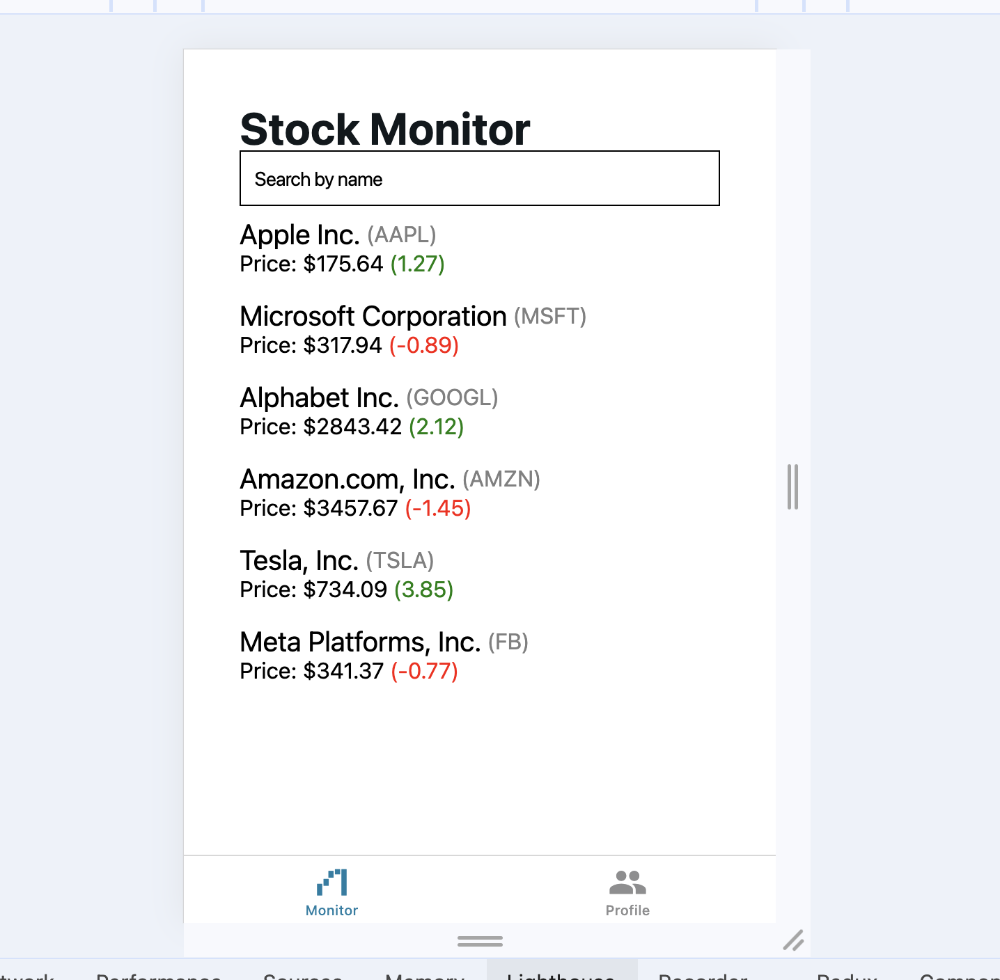

# react-native-stock-monitor

## Setup

1. install dependencies: `npm i`
2. run app using `npm run web`, `npm run android`, `npm run ios`

## Decisions made

Added service to pull data simulating data fetching, for that I used `react-query` package

Created components for stock row and list so it gets easier to maintain

No extra server was needed, the JSON file is hardcoded in the constants folder

Added a few tests using jest.

Even tho filtering works, it still require a good throttle implementation

## Evidence

